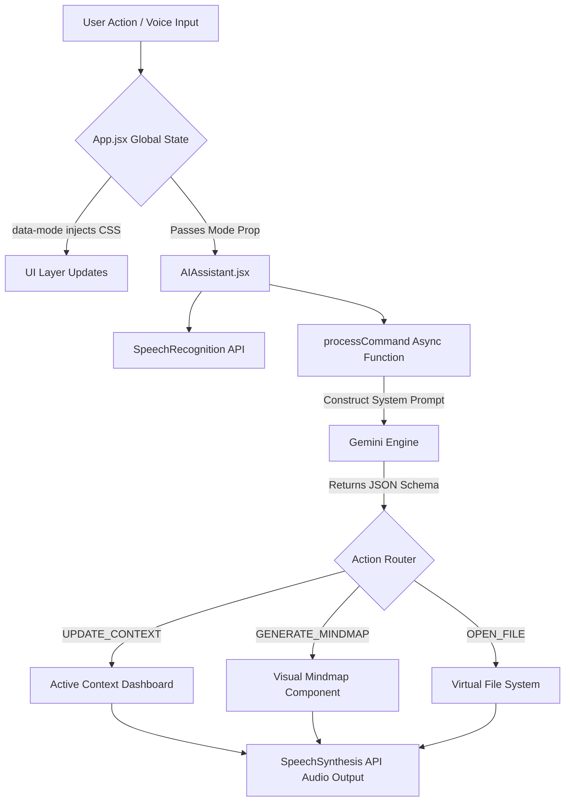

# Accessible Learning App: Technical Architecture & Code Flow

## 1. Executive Summary & Problem Scope
The **Accessible Learning App** is a next-generation, client-heavy React application built specifically to democratize education for individuals navigating cognitive and physical disabilities. Traditional educational technology often layers features on top of inaccessible foundations. This application fundamentally redesigns the learning space using a decoupled, 3-panel **Universal Workspace**. 

By integrating locally managed state parameters with external Large Language Model APIs (Google Gemini Platform), the system acts as a personalized multi-modal scribe, transforming dense text into scalable, understandable formats.

---

## 2. Platform Architecture & Tech Stack
The architecture relies on serverless technologies, minimizing backend maintenance while maximizing the performance required for rapid, real-time Natural Language Processing (NLP).

### Core Stack
*   **Frontend Framework**: React 19 bootstrapped with Vite for instant hot module replacement and optimized production bundling.
*   **Styling Architecture**: Strict **Vanilla CSS** (`index.css` & `UniversalWorkspace.css`). Tailwind CSS was evaluated but intentionally bypassed to allow root-level CSS Variables (`data-mode`) to trigger cascading application-wide layout changes securely.
*   **Authentication & Persistence**: Supabase handles user authentication (Auth) and PostgreSQL Row Level Security (RLS) data persistence for conversation logs and saved contexts.
*   **Generative AI Pipeline**: Google Gemini API SDK (`gemini-2.5-flash` for rapid text structuring and `gemini-1.5-flash` for complex image parsing).
*   **Browser APIs**: Web Speech API handles STT (Speech-to-Text) and TTS (Text-to-Speech) natively.

---

## 3. High-Level System Design & Code Flow

The application flow follows a declarative, state-driven model where the user's cognitive environment parameter (`currentMode`) permanently alters how the UI behaves and how the System Prompt commands the AI.

### Architectural Diagram



### Action Dispatch Flow
When a user initiates an action (e.g., clicking the "Math Help" magic button, or speaking into the Voice GUI), the system triggers the central processing node `processCommand()`. 

1. **State Injection**: The function pulls the active `currentMode` (e.g., *Dyslexia*, *ADHD*, *Dyscalculia*) and resolves it into a specific systemic instruction set.
2. **Context Packaging**: The function scoops up the `virtualFs` (Virtual File System) manifest, the user's current interaction history (`daily_notes.txt`), and the `activeContext`.
3. **API Dispatch**: It bundles this payload into an `application/json` requested format and sends it to the Gemini REST endpoint.
4. **Client Resolution**: Upon resolution, the API returns a structured JSON object containing an `action` and a `spokenResponse`. The `AIAssistant` component modifies local React state accordingly.

---

## 4. Technical Component Breakdown

### 4.1 Global Shell (`App.jsx`)
The `App.jsx` handles core routing (Dashboard vs. Universal Workspace) and manages global User preferences. It fetches historical notes and transcripts from Supabase. 

Crucially, it executes a fundamental hook to orchestrate global themes based on user profiles:
```javascript
  useEffect(() => {
    // Dynamically alters the DOM root to trigger cascading CSS variable overrides
    document.documentElement.setAttribute('data-theme', theme);
    document.documentElement.setAttribute('data-contrast', contrast);
    document.documentElement.setAttribute('data-font', font);
    document.documentElement.setAttribute('data-mode', mode);
  }, [theme, contrast, font, mode]);
```

### 4.2 The Universal Workspace (`AIAssistant.jsx`)
This monolithic component renders the three-pane learning UI. It houses the critical `processCommand` function, which guarantees API determinism by requesting JSON formatting:

```javascript
// Example slice of the adaptive prompt logic in AIAssistant.jsx
let modeInst = "";
if (currentMode === 'dyscalculia') {
    modeInst = "Convert abstract math into relatable storytelling using concrete objects.";
} else if (currentMode === 'asd') {
    modeInst = "Communicate literally. Decode tone explicitly. Generate literal, calming step-by-step Social Stories.";
}

// Instructing the LLM to output predictable JSON states
const systemPrompt = \`
Determine action. Return JSON exactly adhering to this schema:
{
  "spokenResponse": "Text to read aloud or print in chat",
  "action": "NONE" | "UPDATE_CONTEXT" | "OPEN_VIRTUAL_FILE" | "GENERATE_MINDMAP",
  "newContext": "New text content",
  "mindMap": { "root": "...", "branches": [...] }
}\`;
```
By enforcing a strict schema, the UI avoids parsing raw Markdown directly into the DOM (mitigating XSS vulnerabilities) and instead programmatically opens interfaces, like the MindMap component, natively using React's virtual DOM.

### 4.3 Native Sensory Integrations
To reduce the cognitive load of navigating traditional OS dialogs, the app heavily utilizes HTML5 `FileReader` and Base64 encoding.

**Vision AI Handlers:**
When an autistic user needs a spatial description, or a dysgraphic user uploads handwriting:
```javascript
const reader = new FileReader();
reader.onload = async (event) => {
    const base64 = event.target.result.split(',')[1];
    const res = await fetch(url, {
        method: 'POST',
        headers: { 'Content-Type': 'application/json' },
        body: JSON.stringify({
        contents: [{
            parts: [
                { text: "Extract text and correct mechanical grammar exactly." },
                { inlineData: { mimeType: file.type, data: base64 } }
            ]
        }]
        })
    });
};
```
The Base64 stream bypasses traditional cloud bucket uploads to ensure ultra-low latency response times for immediate accessibility correction.

---

## 5. Security & Constraints

### 5.1 Environment Security
As a client-heavy React application, API Keys (such as `VITE_GEMINI_API_KEY`) are functionally exposed to the client bundle. In production pipelines, this environment variable constraint is bypassed by:
1. Routing API calls through a secure Edge Function proxy (such as a Supabase Edge Function or Vercel Serverless Function).
2. Rate-limiting the user's specific JWT session rather than fully exposing the central application key.

### 5.2 Determinism & Hallucination Mitigation
Educational constraints demand low AI hallucination. To prevent the model from entering non-deterministic states, the context engine aggressively rewrites the `daily_notes.txt` virtual log containing active session memory. This anchors the LLM to the immediate user workspace rather than relying strictly on the model's pre-trained generalizations.

---

## 6. Closing Statement
The technical architecture of the Accessible Learning App proves that accessibility is not a "theme" or a plugin; it is an infrastructural paradigm. By uniting deterministic state management in React with the probabilistic power of Generative AI, the platform provides a seamlessly reliable, highly empathetic engine capable of meeting the complex neurodivergent demands of modern students.
